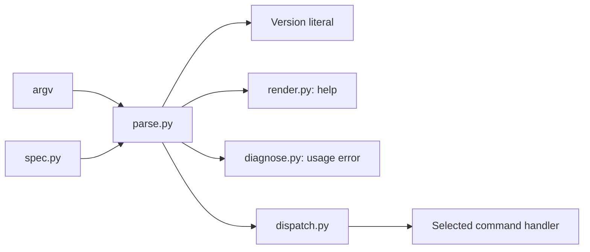

# CLI parsing and dispatch

[definition/](definition/README.md) constructs the option schema. This directory's runtime modules
read the generated tables.

| File          | Job                                                                 |
| ------------- | ------------------------------------------------------------------- |
| `spec.py`     | Generated rows, help text, and command destinations.                |
| `parse.py`    | Walk tokens, reduce repetitions, bind operands, and convert values. |
| `render.py`   | Format help pages.                                                  |
| `diagnose.py` | Format usage errors and suggestions.                                |
| `dispatch.py` | Start output, import the handler, convert paths, and call it.       |

[`nab.cli`](../cli.py) selects the path shown above and reports its status. `Parsed` separates
command values from global output options. Help and version stop parsing before ordinary conversion.

Keep declaration imports off this path: help and usage errors must work without loading command
dependencies. Handlers and configuration live in the parent package; dispatch imports only the
selected handler. Commands write through [`nab.output`](../output.py).
