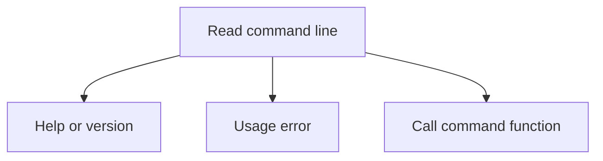

# How a command runs

When you run `nab lock --offline`, nab reads the command name and flags before resolving any
dependencies. The files here do that parsing, show help or errors, and call the Python function for
the chosen command.

## Following `nab lock --offline`

[`nab.cli`](../cli.py) passes the command-line words to `parse.py`. The parser identifies `lock` and
converts `--offline` to `True`. `dispatch.py` then calls [`nab._lock.lock`](../_lock.py), passing
`offline=True` among its arguments.

The command function reads project configuration and uses `nab_project` to resolve dependencies and
write the lock. [The package overview](../../../docs/explanation/packages.md) explains the resolver
libraries beneath that call.

## The files

- [`spec.py`](spec.py): a generated list of accepted flags, their help text, and the function for
  each command.
- [`parse.py`](parse.py): read command-line words and convert values to types such as integers and
  booleans.
- [`render.py`](render.py): format help pages.
- [`diagnose.py`](diagnose.py): format usage errors and suggestions.
- [`dispatch.py`](dispatch.py): set up output, convert path arguments, and call the command
  function.

The parser returns a `Parsed` object. It keeps global output flags, such as `-v`, separate from
command arguments, such as `--offline`. `cli.py` handles help, version, and error results before
importing any command function. Command functions write through [`nab.output`](../output.py).

## Where flags come from

[definition/](definition/README.md) contains the Python declarations used to add or change a flag.
Development scripts turn those declarations into `spec.py` and the configuration option list. The
installed CLI reads these prepared files rather than rebuilding the declarations on each run.
