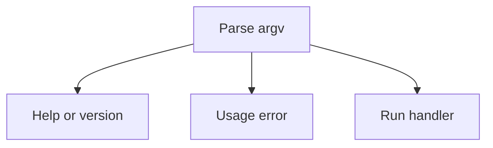

# CLI parsing and dispatch

[definition/](definition/README.md) constructs the option schema. This directory's runtime modules
read the generated tables.

- [`spec.py`](spec.py): generated rows, help text, and command destinations.
- [`parse.py`](parse.py): token parsing and value conversion.
- [`render.py`](render.py): help pages.
- [`diagnose.py`](diagnose.py): usage errors and suggestions.
- [`dispatch.py`](dispatch.py): output setup, path conversion, and handler calls.

[`nab.cli`](../cli.py) selects the path shown above and reports its status. `Parsed` separates
command values from global output options. Help and version stop parsing before ordinary conversion.

Keep declaration imports off this path: help and usage errors must work without loading command
dependencies. Handlers and configuration live in the parent package; dispatch imports only the
selected handler. Commands write through [`nab.output`](../output.py).
