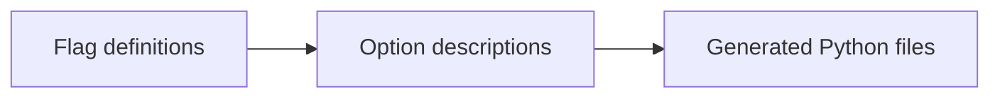

# How flags are defined

[`options.py`](options.py) describes the flags nab accepts: their names, values, help text, and
which commands accept them. Development scripts turn these definitions into Python files that nab
uses to parse commands and read configuration.

## From definitions to generated files

`build.py` makes an `Opt` for each definition. An `Opt` is a data object containing one option's
name, type, defaults, and configuration rules.



- `tasks/gen_cli.py` writes [`spec.py`](../spec.py) for parsing and help, the
  [configuration option list](../../config/registry.py), and the global-flags reference.
- `tasks/gen_bijection.py` writes Python calls to the command functions in `tests/cli_bijection.py`.
  Type checkers use them to check that flag values match the functions' parameters.

## Reading a definition

```python
from nab._cli.definition.rows import Value
from nab._cli.definition.tables import Table


class Example(Table, on=("lock",)):
    max_concurrency = Value[int | None](help="maximum concurrent downloads")
```

This defines `--max-concurrency` for `nab lock`. The attribute supplies the flag name, replacing
underscores with hyphens. `Value[int | None]` reads one integer; an absent flag leaves `None`.

A `Table` groups definitions with shared commands and defaults. `scope` distinguishes project
settings from user settings, and `docs` names their reference page. A definition can override the
table's `on` and `docs` values.

Some settings also come from configuration files or environment variables. `Layer` supplies their
parsing, display, and built-in default. That default can be used when the command receives `None`.
`Key` defines a setting with no flag. The matrix definitions use `under="matrix"` to build flags
such as `--project-matrix-python`, which sets the Python versions to resolve for.

## Where to look

- [`options.py`](options.py): add or change a flag.
- [`rows.py`](rows.py): constructors such as `Value` (one value) and `Many` (a repeated flag).
- [`tables.py`](tables.py): apply shared defaults and reject duplicate definitions.
- [`types.py`](types.py): read types and allowed values from Python annotations.
- [`build.py`](build.py): combine a definition with its type information into an `Opt`.
- [`model.py`](model.py): define `Opt`, derive flag names, and check option combinations.

## Regenerating after a change

Update the definition and its command function's parameters, then run from the repository root:

```bash
python tasks/gen_cli.py --write
python tasks/gen_bijection.py --write
```

Commit the generated files. Both scripts support `--check` to detect stale output.
`test_option_rows.py` checks definition rules; `test_cli_conformance.py` checks command parameters.
[How a command runs](../README.md) follows these files into an invocation of nab.
