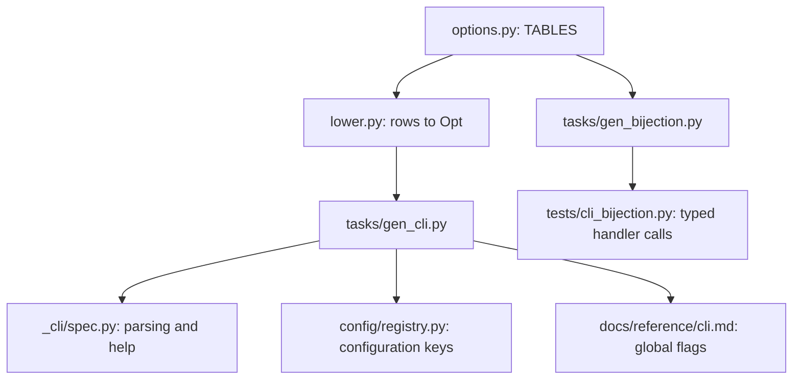

# Constructing the CLI

Start in [`options.py`](options.py). It declares the named option tables in help order.

## From declarations to generated files



## Where each rule lives

| File         | Job                                                                 |
| ------------ | ------------------------------------------------------------------- |
| `options.py` | The shipped declarations.                                           |
| `rows.py`    | Typed constructors such as `Value`, `Tri`, `Many`, and `Layer`.     |
| `tables.py`  | Apply table defaults; reject duplicate declarations.                |
| `types.py`   | Infer scalar types, choices, and nullability.                       |
| `lower.py`   | Combine row metadata and inferred types into `Opt`.                 |
| `model.py`   | Define `Opt`, derive flag names, and validate option relationships. |

## Reading a declaration

```python
from nab._cli.definition.rows import Value
from nab._cli.definition.tables import Table


class Example(Table, on=("lock",)):
    max_concurrency = Value[int | None](help="maximum concurrent downloads")
```

The attribute names `--max-concurrency`; the type parameter declares integer conversion and accepts
`None`. `Table` supplies command membership, scope, and a documentation page; a row can override
`on=` and `docs=`.

`Layer[C]` adds configuration parsing, rendering, and its built-in default. That default differs
from the CLI default: an absent flag can pass `None` while the configuration ladder supplies a
value. `under=` rows set individual keys of a configuration table; `Key` declares a file-only
setting.

## Changing an option

Edit `options.py` and its handler signature, then run from the repository root:

```bash
python tasks/gen_cli.py --write
python tasks/gen_bijection.py --write
```

Commit the generated files. Both generators support `--check`. `test_option_rows.py` covers
construction rules; `test_cli_conformance.py` and the generated typed calls check handler
signatures. [Runtime parsing](../README.md) consumes `spec.py` without importing these declarations.
